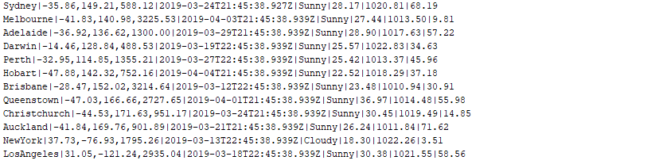

# Weather Simulation Assessment
*Author* : Dash Nava
*Email*  : dharshan.navaratnam@gmail.com

## Abstract
This assessment is implemented by modularising into logical components. The component details are listed below.
### weather-domain
This module compromises the domain objects related to this assessment
### weather-simulator
This module compromises the business and infrastructure services to generate simulated weather.
### weather-reports
This module compromises the services to transform the weather simulations into flat report structure

#### Below is the snapshot of a sample flat record.

### weather-api
This module compromises the services to serve the weather simulations as a REST web service and visually represent as a web application.

#### Below is the snapshot of the Swagger UI for the Weather Rest API.

#### Below is the snapshot of the visual representation from the web application.

## Build and Run
### Pre-requisite
* JDK 1.8
* Maven 3
* Access to internet (To download maven dependencies and plugins)
### Environment Setup
* Set JAVA_HOME environment variable
* Set MAVEN_HOME environment variable
* Include java and mvn executables in the user path
### How to build
* Checkout the source code
* Execute the following command from a terminal/command prompt to build
  > mvn clean install
### How to run
* To generate weather simulation flat reports, Execute the following command from a terminal/command prompt to build
  > Change into directory weather-reports
  
  > mvn exec:java -Dexec.mainClass="com.commbank.weather.report.WeatherReportRunner"
* To run weather simulation API and Web Application, Execute the following command from a terminal/command prompt to build
  > Change into directory weather-api
  
  > mvn spring-boot:run -f pom.xml
  
  * Access the API
    The API is exposed using swagger. The swagger endpoint to test out the API is located at the below URI.
    > http://localhost:9091/swagger-ui.html
    
  * Access the web application
    The endpoint for the web application is located at the below URI.
    > http://localhost:9091/dashboard